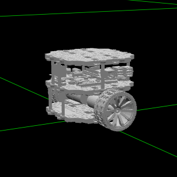

# self-driving-robot
A Self-Driving Robot developed in ROS

Based on the udemy course "Self Driving and ROS" by Antonio Brandi
https://www.udemy.com/course/self-driving-and-ros-learn-by-doing-odometry-control/ 

